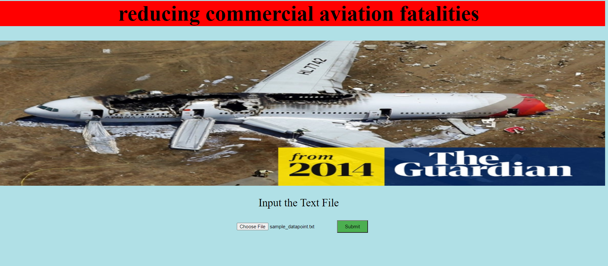
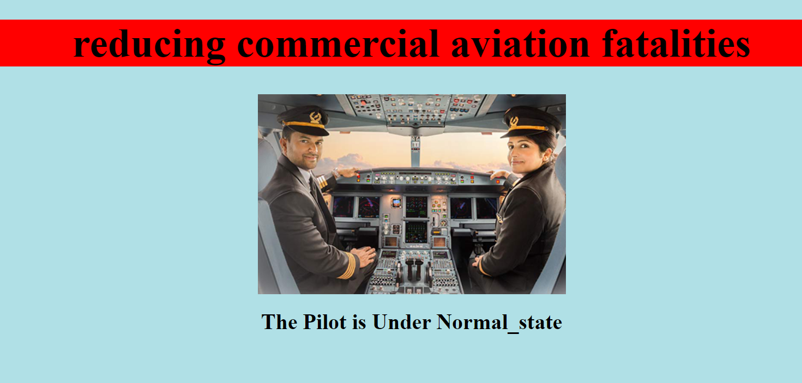

# reducing-commercial-aviation-fatalities
We all Know that Aviation is the Key Industry to Globalization.It Constitutes nearly 30% of Share in Transportation only in India every year. Besides this, a lot of Aviation Fatalities are taking place every year. Nearly, total fatalities due to aviation accidents since 1970 is 83,772 across the world. There are many reasons like Pilot error, Mechanical failure, Design defect, Air traffic failure, Defective runways. But here our main focus is on aviation accidents caused by pilot error, and solutions to avoid them so that accidents in aviation industry can be reduced results in saving of lives of people and money to airline.
# Demo Link: ["https://www.youtube.com/watch?v=cQfz70f1R2k"](https://www.youtube.com/watch?v=cQfz70f1R2k)

# Website Demo

# Getting Predictions from User: 

# Predictions Page:

# Tools and languages Used
* Front-End: HTML, CSS
* Back-End: Flask
* IDE: Jupyter notebook, Pycharm

# Workflow

# Data Collection: 
[Reducing Commercial Aviation Fatalities](https://www.kaggle.com/c/reducing-commercial-aviation-fatalities) from Kaggle

# Data Preprocessing: 
* As these are Biological Features we have Removed Noise in the Features using api like signal in scipy package.
* Adding Potential Difference Features as they are contributing more for the Classifying.
* Added Power Features (Electroencephalography (EEG) power features represents amount of activity in certain frequency bands of the signal while coherence between different electrodes reflects the degree to which connections are present across brain regions).
* Used Auto Encoders to get Additional Compressed Features and Added them on top of already Presented Features.
* Applied MinMax() Scaling for all the Features.
* Used the Random Forest model for getting Feature Importance.

# Model Creation:
* Different types of models were tried like logistic Regression, stacking, LightGBM Model
* Out of these LightGBM Performed Well
* We have Taken Multi-class Log-loss as our Primary Metric. Here, we are predicting the state of mind of the pilots and we are predicting what is the probability that the pilot is Falling into any of the states. In the process of predicting our model should not falsely predict that the pilot in Normal state while pilot is actually in some Dangerous State. Here we need to take care of these misclassifications and we need to penalize even every small error in probability that we make.So for this Situation Multi-class Log-loss as a metric Makes Sense.

# Model Deployment
* The model is deployed using Flask in Local System.

# If you like this project please do give a star. I am also giving my LinkedIn profile. If you want we can connect there too
